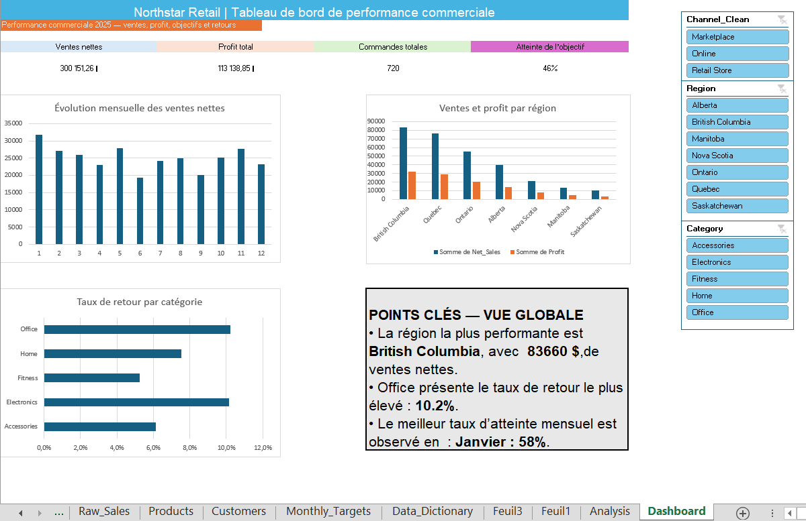

# Northstar Retail Sales Analysis

## Project overview

This Excel project analyzes 2025 retail sales performance for Northstar Retail. The goal was to turn a messy transaction dataset into a decision-ready dashboard showing sales, profit, targets, returns, and performance by region, category, and sales channel.

## Business questions

- How did net sales evolve during 2025?
- Which regions generated the most sales and profit?
- Which product categories had the highest return rate?
- Were monthly sales targets achieved?
- How do results change by channel, region, and category?

## Data preparation

The source data contained 721 rows. I cleaned and enriched it in Excel:

- Removed 14 duplicate records, leaving 720 transactions.
- Standardized channel, store, payment, and customer fields.
- Parsed customer information using text functions.
- Enriched transactions with product name, category, and unit cost using `VLOOKUP`.
- Created calculated fields for gross sales, discounts, net sales, total cost, profit, profit margin, return flag, and date attributes.

## Dashboard

The dashboard includes:

- Net sales, total profit, total orders, and target-attainment KPIs.
- Monthly net-sales trend.
- Net sales and profit by region.
- Return rate by category.
- Slicers for channel, region, and category.
- A global insight panel.

## Key insights

- Net sales totaled **$300,151.26** and total profit was **$113,138.85** across **720 orders**.
- Overall target attainment was **45.8%**.
- **British Columbia** was the top-performing region, with **$83,660.34** in net sales.
- **Office** had the highest return rate at **10.2%**.
- **January** had the strongest monthly target attainment at **58%**.

## Tools and skills used

- Microsoft Excel
- Excel Tables
- Text cleaning functions
- `VLOOKUP`
- Calculated columns and business metrics
- PivotTables and PivotCharts
- `GETPIVOTDATA`
- Slicers and dashboard design

## How to use

Open `Northstar_Retail_Sales_Analysis.xlsx`, then open the `Dashboard` worksheet. Use the slicers on the right to explore the charts by channel, region, and category. The KPI cards and insight panel present the full-year global view.

## Workbook structure

- `Raw Sales`: original transaction data
- `Products`: product reference table
- `Customers`: customer reference table
- `Monthly Targets`: monthly sales targets
- `Data Dictionary`: field definitions
- `Analysis`: PivotTables and supporting analysis
- `Dashboard`: final interactive reporting view
