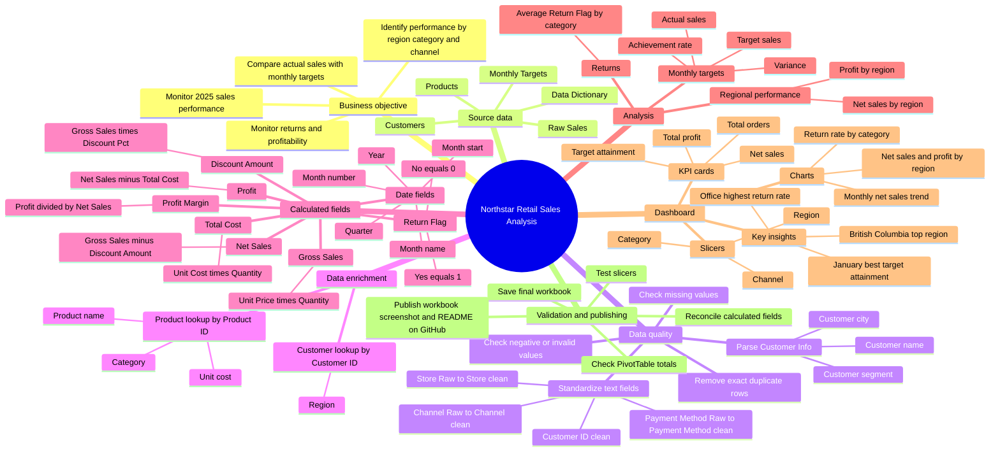

# Northstar Retail Sales Analysis — Project Mind Map

## Project outcome

The project transformed raw retail transactions into an Excel dashboard for monitoring sales, profit, targets, returns, and performance drivers.
